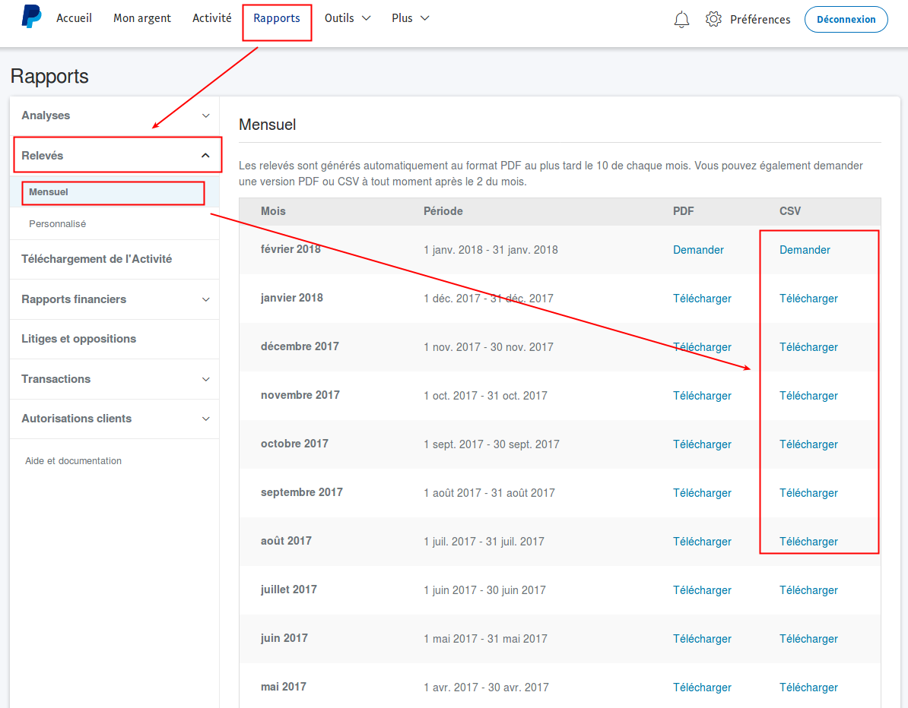

=============================
Import Paypal Bank Statements
=============================

.. !!!!!!!!!!!!!!!!!!!!!!!!!!!!!!!!!!!!!!!!!!!!!!!!!!!!
   !! This file is generated by oca-gen-addon-readme !!
   !! changes will be overwritten.                   !!
   !!!!!!!!!!!!!!!!!!!!!!!!!!!!!!!!!!!!!!!!!!!!!!!!!!!!

.. |badge1| image:: https://img.shields.io/badge/maturity-Beta-yellow.png
    :target: https://odoo-community.org/page/development-status
    :alt: Beta
.. |badge2| image:: https://img.shields.io/badge/licence-AGPL--3-blue.png
    :target: http://www.gnu.org/licenses/agpl-3.0-standalone.html
    :alt: License: AGPL-3
.. |badge3| image:: https://img.shields.io/badge/github-OCA%2Fbank--statement--import-lightgray.png?logo=github
    :target: https://github.com/OCA/bank-statement-import/tree/11.0/account_bank_statement_import_paypal
    :alt: OCA/bank-statement-import
.. |badge4| image:: https://img.shields.io/badge/weblate-Translate%20me-F47D42.png
    :target: https://translation.odoo-community.org/projects/bank-statement-import-11-0/bank-statement-import-11-0-account_bank_statement_import_paypal
    :alt: Translate me on Weblate
.. |badge5| image:: https://img.shields.io/badge/runbot-Try%20me-875A7B.png
    :target: https://runbot.odoo-community.org/runbot/174/11.0
    :alt: Try me on Runbot

|badge1| |badge2| |badge3| |badge4| |badge5| 

This module allows you to import the Paypal CSV files in Odoo as bank statements.

**Table of contents**

.. contents::
   :local:

Configuration
=============

In the menu Accounting > Configuration > Accounting > Bank Accounts,
make sure that you have your Paypal bank account with the following parameters:
* Bank Account Type: Normal Bank Account
* Account Number: the email address associated with your Paypal account
* Account Journal: the journal associated to your Paypal account

TIPS
~~~~
For now only French and English report are supported.
For adding new support you just need to add your header in
model/account_bank_statement_import_paypal.py in the variables HEADERS.
Please help us and do a PR for adding new header ! Thanks

Usage
=====

To use this module, you need to:

#. Go to Paypal and download your Bank Statement

.. image:: account_bank_statement_import_paypal/static/description/paypal_backoffice.png
    :alt: .

Bug Tracker
===========

Bugs are tracked on `GitHub Issues <https://github.com/OCA/bank-statement-import/issues>`_.
In case of trouble, please check there if your issue has already been reported.
If you spotted it first, help us smashing it by providing a detailed and welcomed
`feedback <https://github.com/OCA/bank-statement-import/issues/new?body=module:%20account_bank_statement_import_paypal%0Aversion:%2011.0%0A%0A**Steps%20to%20reproduce**%0A-%20...%0A%0A**Current%20behavior**%0A%0A**Expected%20behavior**>`_.

Do not contact contributors directly about support or help with technical issues.

Credits
=======

Authors
~~~~~~~

* Akretion

Contributors
~~~~~~~~~~~~

* Alexis de Lattre <alexis.delattre@akretion.com>
* Sebastien BEAU <sebastien.beau@akretion.com>
* Tecnativa (https://www.tecnativa.com)

  * Vicent Cubells <vicent.cubells@tecnativa.com>

Maintainers
~~~~~~~~~~~

This module is maintained by the OCA.

.. image:: https://odoo-community.org/logo.png
   :alt: Odoo Community Association
   :target: https://odoo-community.org

OCA, or the Odoo Community Association, is a nonprofit organization whose
mission is to support the collaborative development of Odoo features and
promote its widespread use.

This module is part of the `OCA/bank-statement-import <https://github.com/OCA/bank-statement-import/tree/11.0/account_bank_statement_import_paypal>`_ project on GitHub.

You are welcome to contribute. To learn how please visit https://odoo-community.org/page/Contribute.
