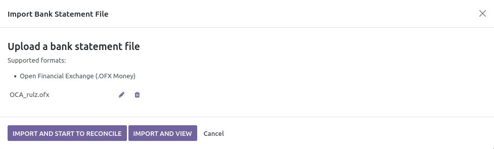

This module is a glue module between 2 modules:

* **account_statement_import_file** from the Github project *OCA/bank-statement-import*
* **account_reconcile_oca** from the Github project `OCA/account-reconcile <https://github.com/OCA/account-reconcile>`_

This module adds a button **Import and Start to Reconcile** on the bank statement file import wizard. When you click on this button, Odoo will import the bank statement file and jump directly to the reconciliation interface.

