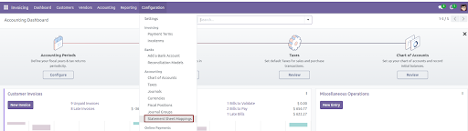
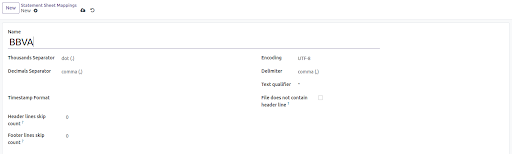
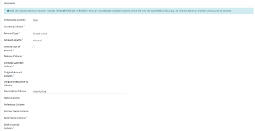
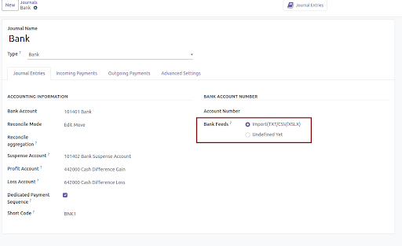
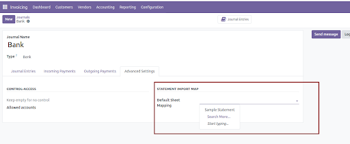

To configure this module, you need to:
1. Create a Statement Sheet Mappings: Go to > Invoicing > Configuration > Accounting > Statement Sheet Mappings

2. Create a New Mapping and configure it:

- Name: Specify the name of the field as per your bank statement.
- Thousands Separator and Decimal Separator: Specify the format of the number.
- Timestamp Format: Specify the format of the date. For example:
  - %d/%m/%Y = 01/05/2022
  - %d/%m/%y = 01/05/22
  - %d-%m-%Y = 01-05-2022
  - %Y-%m-%dT%H:%M:%SZ = 2022-05-01T15:22:10Z
- Header lines skip count: The number of the line that contains the tags of the data.
- Footer lines skip count: Amount of lines to skip of the footer.

3. Configure the columns to match your bank statement format:

At least, you have to configure:
- Timestamp Column
- Amount type and amount Column
- Description Column

4. Set the Mapping as default in the bank journal and the bank feeds:

