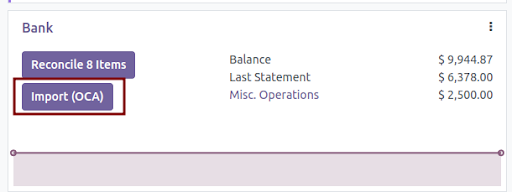
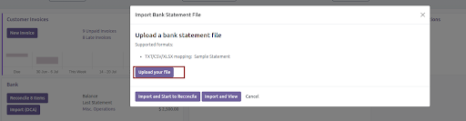
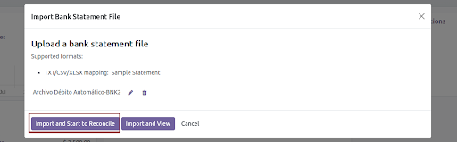

Once you have the Mapping and the Journal set up, you have to import the bank statement

1. Go to Account > Dashboard
2. Click “Import OCA” in the bank journal configured.

3. Then “Upload your file”

4. Pick your bank file already downloaded.
5. Import and Start to Reconcile

